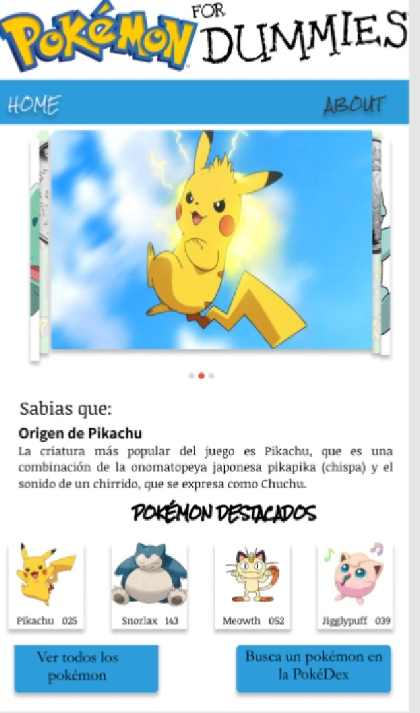

# Data Lovers - Pokémon for Dummies

[Open Pokémon for Dummies](https://lizgarciac.github.io/GDL002-data-lovers/src/)

## Índice Proyecto 

- [Generales](#Consideraciones-Generales)
- [Descripción](#Resumen-del-proyecto)
- [Proceso de Diseño](#Prototipo-de-Bajo/Alto-nivel)
- [Necesidades de usuario](#Funcionalidad)
- [Adaptabilidad](#Responsive-Design)
- [Pruebas de Usabilidad](#User-Test)

---
## Consideraciones generales

- Este proyecto fué realizado en dupla.
- El proyecto ha sido entregado subiendo el código a GitHub (commit/push) y la
  interfaz será desplegada usando [GitHub Pages](https://pages.github.com/).
- Tiempo de desarrollo: 2 semanas divididas en 2 sprints (una entrega del producto funcional al término de cada sprint).

## Resumen del Proyecto

Es una página que permite al usuario introducirse al mundo de *Pokémon GO*, ofreciendo ayuda visual para conocer a todos los pokémos con sus características básicas; así como de manera individual y con un extra para calcular hasta donde puede extender su fortaleza, un pokémon de manera individual.

  - Pokemon GO es un videojuego de aventura de realidad aumentada, para dispositivos iOS y Android. Consiste en buscar, capturar, y luchar con los personajes de la saga Pokémon. 

## Prototipo de Bajo/Alto Nivel

Para lograr el objetivo de la aplicación, se consideraron las solicitudes de los usuarios principiante ó de poca experiencia.

**Prototipo Inicial:**

 

En este diseño se muestran las primeras primeras propuestas para las pantallas, donde se muestran las acciones:

1.- Ver más Pokémon.

   Aqui podrás ver la lista completa de los 151 Pokémon con su imagen y nombre.
      
2.- Busca un Pókemon.

  En esta sección podrás realizar busquedas personalizadas de cualquiera de los 151 Pokémon, el resultado de la búsqueda te arrojará los detalles más importantes del Pokémon buscado incluyendo su imágen.

  3.- Calcula el PC.

  Los PC o CP, abreviaturas de Poder de Combate y Combat Power, son una unidad de la fortaleza de un Pokémon.
  Esta medida nos indica lo fuerte que es un Pokémon y es individual de cada ejemplar. Por ejemplo, diferentes Pikachus que se capturen tendrán diferentes medidas de PC. Es un indicativo de lo bien que se comportarán en un combate.

**Prototipo de alto nivel:**

Tomando en cuenta los detalles ya mencionados, y despúes de algunos cambios, como el de agregar una pantalla principal, se creo el prototipo en FIGMA, quedando como se muestra a continuación.

**1.- Pantalla Inicial**

**2.- Ver todos los Pokémon**

-Con la opción "Ordenar Alfabéticamente"

**3.- Buscar un Pokémon**

-Con la opción de Ingresar el PC de manera individual

**4.- About**

-Acerca de las funciones y ventajas de la aplicación

#### Testeos de usabilidad

Durante el reto deberás realizar tests de usabilidad con distintos usuarios, y
en base a los resultados de esos tests, deberás iterar tus diseños. Cuéntanos
qué problemas de usabilidad detectaste a través de los tests y cómo los
mejoraste en tu propuesta final.

### Implementación de la Interfaz de Usuario (HTML/CSS/JS)

Luego de diseñar tu interfaz de usuario deberás trabajar en su implementación.
Como mencionamos, **no** es necesario que construyas la interfaz tal como la
diseñaste. Tendrás un tiempo limitado para hackear, así es que deberás
priorizar.

Como mínimo, tu implementación debe:

1. Mostrar la data en una interfaz: puede ser un card, una tabla, una lista, etc.
2. Permitir al usuario filtrar y ordenar la data.
3. Calcular estadísticas de la colección (o subcolección) como media aritmética,
   máximo y/o mínimo de algún atributo numérico, o contar cuántas veces aparece
   un determinado valor, por ejemplo.
4. Visualizarse sin problemas desde distintos tamaños de pantallas: móviles,
   tablets y desktops.

Es importante que tu interfaz, a pesar de ser una versión mínima de tu ideal,
siga los fundamentos de _visual design_.

#

### Herramientas

- [Git](https://git-scm.com/)
- [GitHub](https://github.com/)
- [GitHub Pages](https://pages.github.com/)
- [Node.js](https://nodejs.org/)
- [Jest](https://jestjs.io/)

---

## Checklist

- [ ] Usa VanillaJS.
- [ ] No hace uso de `this`.
- [ ] Pasa linter (`npm pretest`)
- [ ] Pasa tests (`npm test`)
- [ ] Pruebas unitarias cubren un mínimo del 70% de statements, functions y
      lines y branches.
- [ ] Incluye _Definición del producto_ clara e informativa en `README.md`.
- [ ] Incluye historias de usuario en `README.md`.
- [ ] Incluye _sketch_ de la solución (prototipo de baja fidelidad) en
      `README.md`.
- [ ] Incluye _Diseño de la Interfaz de Usuario_ (prototipo de alta fidelidad)
      en `README.md`.
- [ ] Incluye el listado de problemas que detectaste a través de tests de
      usabilidad en el `README.md`.
- [ ] UI: Muestra lista y/o tabla con datos y/o indicadores.
- [ ] UI: Permite ordenar data por uno o más campos (asc y desc).
- [ ] UI: Permite filtrar data en base a una condición.

